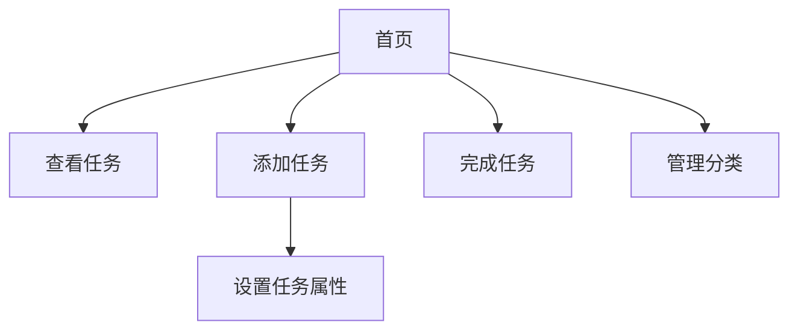

## 1. Product Overview
一款简洁高效的待办事项管理应用，帮助用户组织日常任务和提高工作效率。
- 主要功能：任务创建、分类管理、完成标记、任务提醒
- 目标用户：所有需要管理日常任务的用户

## 2. Core Features

### 2.1 User Roles
| Role | Registration Method | Core Permissions |
|------|---------------------|------------------|
| Normal User | Local storage | Create, edit, delete, complete tasks |

### 2.2 Feature Module
1. **首页**: 任务列表、任务分类筛选、添加任务按钮
2. **任务详情页**: 任务详情编辑、提醒设置
3. **分类管理页**: 创建和管理任务分类

### 2.3 Page Details
| Page Name | Module Name | Feature description |
|-----------|-------------|---------------------|
| 首页 | 任务列表 | 显示所有待办和已完成任务，支持滑动删除，支持分类筛选 |
| 首页 | 添加任务 | 弹出框形式添加新任务 |
| 任务详情页 | 编辑任务 | 编辑任务标题、描述、截止日期、分类 |
| 分类管理页 | 分类列表 | 显示所有分类，支持添加、删除分类 |

## 3. Core Process
用户打开应用 → 查看任务列表 → 添加新任务 → 设置任务属性 → 完成任务 → 管理分类

## 4. User Interface Design
### 4.1 Design Style
- 主色调：蓝色系（#3B82F6），次色调：灰色系（#64748B）
- 按钮风格：圆角矩形，带轻微阴影
- 字体：现代无衬线字体，清晰易读
- 布局风格：卡片式布局，简洁现代
- 图标风格：简单线条图标

### 4.2 Page Design Overview
| Page Name | Module Name | UI Elements |
|-----------|-------------|-------------|
| 首页 | 任务列表 | 卡片式列表，滑动操作，动画过渡 |
| 首页 | 添加任务按钮 | 浮动操作按钮(FAB)，带点击动画 |
| 任务详情页 | 任务表单 | 简洁表单，日期选择器 |
| 分类管理页 | 分类列表 | 可编辑的分类列表 |

### 4.3 Responsiveness
移动端优先设计，适配不同屏幕尺寸，优化触摸操作

### 4.4 3D Scene Guidance
不适用

